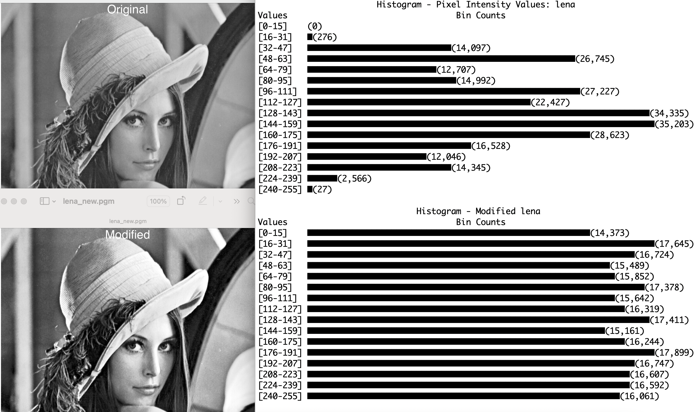

# projects
# Contrast Enhancement
The primary method of manipulating contrast is histogram equalization. However, if the 
original image is already equalized, the resulting image will be similar or identical.
My code groups pixel grayscale values into sixteen bins. If the standard deviation of 
total pixels in each bin is substantially lower than the overall mean, the code employs
a modifiied square root method of contrast manipulation instead of histogram equalization.  

  Portions of the image contrast enhancement code were adapted and modified from the following sources:
https://medium.com/hackernoon/histogram-equalization-in-python-from-scratch-ebb9c8aa3f23 by Tory Walker
https://fog.ccsf.edu/~abrick/notes/231-15.pdf by Aaron Brick
